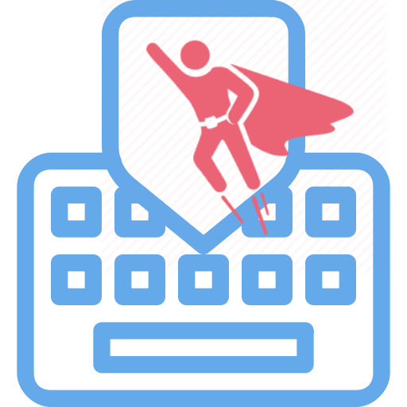

  

<h1 align="center">Keyboard Hero</h1>

  

  

<h2 align="center">
  💻 <a href="https://keyboard-hero.netlify.app/">Preview</a>
</h2>

## 🎯 Challenge

Esse projeto foi realizado no [Challenge 11 da FW7](https://github.com/fw7-solucoes/challenges/tree/master/challenge-11), um desafio com o propósito de estudo e gerar engajamento com a comunidade de desenvolvimento.

---

## 📕 Sobre

Nesse desafio o objetivo era criar uma mini jogo utilizando o teclado, onde o usuário terá **60** segundos para conseguir acertar o maior número de letrar que aparecem no teclado. As letras são aleatórias e conforme o usuário for apertando alguma letra no teclado é apresentado os acertos e erros em tempo real.

 

✅ Objetivos a serem alcançados.

- Deve ser gerado uma letra aleatória e apresentar para o usuário.
- Deve haver um contador decrescente de 60 segundos.
- Deve apresentar os acertos e erros.
- Deve considerar cada evento no teclado para contabilizar os acertos e erros.
- Deve ser gerado uma nova letra sempre que o usuário acertar.

---

## 💪 Diferencial

Como é de praxe em todos os _challenges_ há um _plus_, implementações adicionais que estão fora do escopo, as minhas foram as seguintes.

 

✅ Implementações extras.

- Layout de um teclado.
- Não contabilizar como um erro as teclas que não são letras.
- Não randomizar a mesma letra em sequência.
- Música de fundo.
- Nos últimos 5 segundos é realizado um efeito sonoro para cada segundo faltante.
- Nos últimos 5 segundos é acelerado a música.
- Efeito sonoro, quando acerta e quando erra.

---

## 🚀 Tecnologias utilizadas

Tecnologias que utilizem para resolução desse desafio.

- React
- CSS3
- Javascript
- Typescript
- Netlify

---

Você pode ver o resultado final aqui: [Preview](https://keyboard-hero.netlify.app/).

by [Roberto Umbelino](https://github.com/robertoumbelino)
